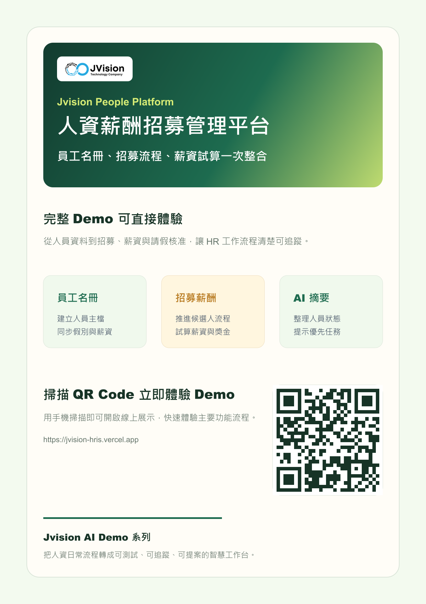

# Jvision 人資薪酬招募管理平台

可互動展示的 HRIS Demo，整合員工資料、招募流程、薪資試算、請假準假、績效追蹤與 AI 人資摘要。

## 線上 Demo

[https://jvision-hris.vercel.app](https://jvision-hris.vercel.app)

## 行銷海報



## 檔案

- [海報 PNG](./public/jvision-hris-poster.png)
- [海報 PDF](./public/jvision-hris-poster.pdf)
- [產品介紹 PDF](./public/jvision-hris-product-introduction.pdf)

## Demo 功能

- 快速新增員工與候選人資料
- 招募流程與入職任務追蹤
- 薪資預估與月薪總額統計
- 請假準假與績效狀態管理
- AI 人資摘要與優先推進建議

## 指令

```bash
npm install
npm run build
npm run assets
npm run verify
```
